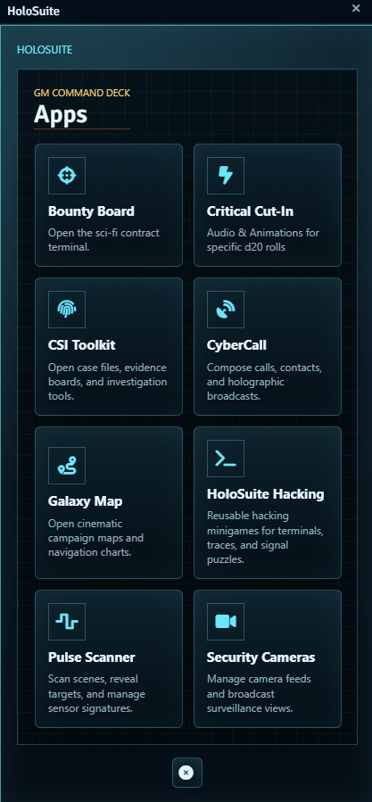

# HoloSuite

HoloSuite is a collection of Foundry VTT modules built for sci-fi, cyberpunk, and space-opera tabletop games. Each module adds a specific tool to your sessions, and they all connect through a shared launcher called HoloSuite Core.

## The Modules

- **[HoloSuite Core](holosuite-core/README.md)** - A free in-world phone launcher that gives the GM one-click access to every installed HoloSuite app.
- **[CyberCall](cybercall/README.md)** - Holographic communication overlays with caller portraits, signal effects, ringtones, and player-to-GM calling.
- **[Security Cameras](security-cameras/README.md)** - A surveillance camera system with live and static feeds, cyberpunk overlays, and GM-to-player broadcasting.
- **[CSI Toolkit](csi-toolkit/README.md)** - Interactive case boards for investigations, with draggable evidence cards, connection lines, timelines, and collaborative player editing.
- **[Galaxy Map](galaxy-map/README.md)** - Cinematic star maps with clickable systems, travel routes, ship animations, and discovery notifications.
- **[Bounty Board](bounty-board/README.md)** - A bounty contract board for posting and browsing sci-fi jobs and contracts.
- **[Critical Cut-In](holosuite-critical-cutin/README.md)** - Anime-style critical hit animations triggered by natural d20 rolls, with per-character images, sounds, and overlay text.
- **[HoloSuite Hacking](holosuite-hacking/README.md)** - Interactive hacking minigames where skill checks determine puzzle difficulty. Includes Node Intrusion and Signal Alignment.

Pulse Scanner is distributed separately as a premium HoloSuite module.
