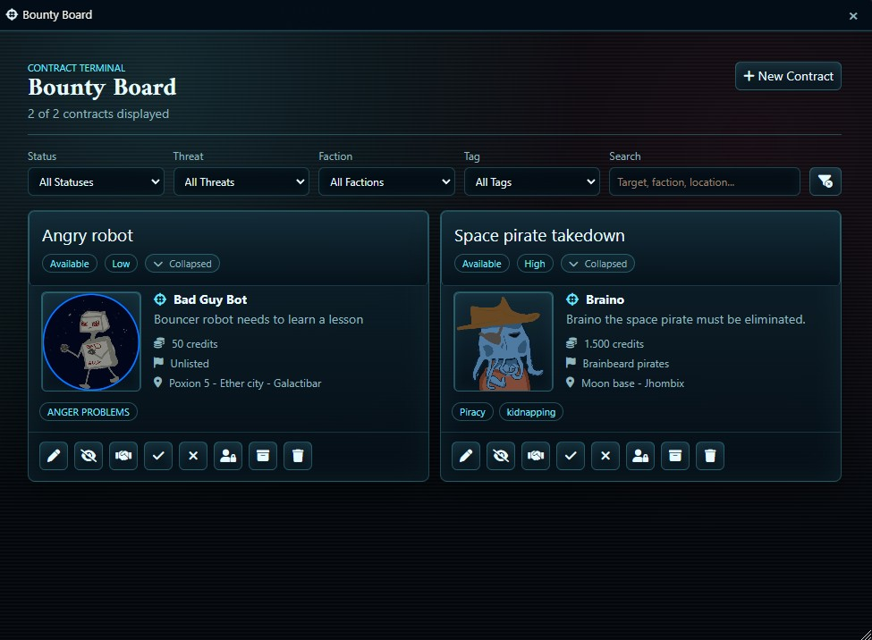

# Bounty Board

Bounty Board is a Foundry VTT module for managing bounty contracts in your game. It gives the GM a place to post bounties and lets players browse available contracts, all presented in a sci-fi/modern setting.

## What Does It Do?

- Provides a bounty board interface where the GM can create and manage bounty contracts.
- Players can browse the board to see available bounties with their details.
- Contracts can be posted, updated, and removed as the story progresses.
- Designed to be a natural fit for sci-fi campaigns where bounty hunting, mercenary work, or contract jobs are part of the setting.

## Tutorial: Using Bounty Board as a DM

### Getting Started

1. Enable **Bounty Board** & **Holosuite-core** in your Foundry world.
2. Open the bounty board from the HoloSuite launcher.
3. Create bounty contracts with the details your players need: target name, reward, description, and any conditions.
4. Post bounties when the players visit a hub, pick up a job, or receive a contract from an NPC.
5. Update or remove bounties as contracts are completed, expired, or cancelled.

## Tutorial: Using Bounty Board as a Player

### Browsing Bounties

1. Open the bounty board from the HoloSuite launcher if available.
2. Browse the list of available contracts. Each bounty shows its details, target, and reward.
3. Discuss with your party which contracts to take on.

### Things to Know

- The GM controls which bounties are on the board and when they appear.
- You can view bounty details but the GM manages the board itself.
