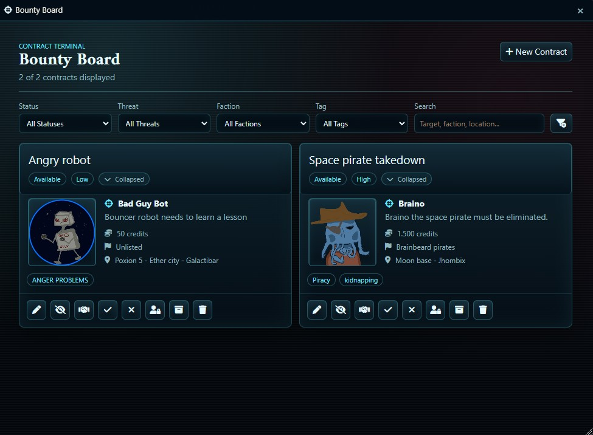

# Bounty Board

Bounty Board gives your group one place for contracts, targets, and rewards. GMs can publish and update jobs as the story changes, while players browse the live board and request the work that interests them.

## Installation

Bounty Board requires HoloSuite Core. Galaxy Map is optional and only needed for the map integration.

1. Install **HoloSuite Core** and **Bounty Board** from Foundry's Add-on Modules screen.
2. Enable both modules in your world.
3. Open the HoloSuite launcher from the scene controls and choose **Bounty Board**.

## Quick Start

The GM manages the contracts, while players see only the jobs that have been published.

1. Open Bounty Board as a GM and choose **New Contract**.
2. Add the contract ID, title, target, reward, threat level, and description. You can also add an image, faction, location, tags, a longer dossier, and a linked Journal.
3. Enable **Published to Players** and save the contract. The terminal options let you show or hide the entire board and manage several filtered contracts at once.
4. Players can search and filter the board, open a contract's details, and choose **Request Contract**. A request posts to chat for the GM; it does not assign the contract automatically.
5. Use **Assign**, **Complete**, **Mark Failed**, **Hide**, or **Archive** to keep each contract in step with the campaign.
6. To connect a contract to Galaxy Map, enable both modules and choose a Foundry Scene under **Location / Scene** in the bounty editor. Link that same Scene to a Galaxy Map system or entity. Published bounty intel then appears when the marker is hovered, and selecting the card opens the full contract in Bounty Board. Unpublished or otherwise hidden contracts stay private.

Bounty Board works normally when Galaxy Map is not installed or enabled.

## Video

Watch the short Bounty Board overview.

[Bounty Board overview video](https://raw.githubusercontent.com/Thuurvdv/HoloSuite/main/docs/assets/videos/BountyBoard-clip.mp4)
