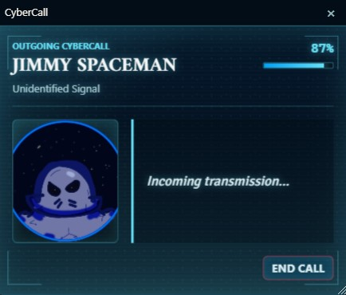

# CyberCall

CyberCall adds sci-fi holographic communication overlays to your Foundry VTT sessions. Whether you are running a cyberpunk heist, a space opera, or a futuristic detective story, CyberCall lets the GM place incoming transmissions directly on every player's screen, complete with caller portraits, signal static, and ringing animations.

Players can also call the GM using a built-in contacts directory, making two-way in-character communication part of the game.

## What Does It Do?

- The GM composes and broadcasts holographic calls to all connected players.
- Calls display a caller portrait, name, faction, message, and signal strength bar.
- Three visual styles are available: standard blue, emergency red, and corrupted green.
- Calls can ring with a looping sci-fi ringtone until someone picks up.
- Players can accept or end calls, and the state syncs across all connected clients.
- Fullscreen mode turns a call into a dramatic table-wide broadcast.
- Players can keep a personal contacts list and a shared group contacts list, and place calls to the GM from those contacts.

## Tutorial: Using CyberCall as a DM

### Sending a Call

1. Enable **CyberCall** & **Holosuite-core** in your Foundry world.
2. Open the **CyberCall Composer** from the HoloSuite launcher.
3. Fill in the caller's name, faction or subtitle, portrait image path, and message text.
4. Set the signal strength (0 to 100). Lower values add more static to the display.
5. Pick a variant: **Standard** (blue), **Emergency** (red), or **Corrupted** (green).
6. Toggle **Fullscreen** if you want the call to fill the entire screen.
7. Toggle **Ringing** if you want the incoming call animation to play before the message appears.
8. Click **Preview Locally** to see how it looks on your own screen first.
9. Click **Broadcast to Players** to push it to everyone.

### During the Call

- When a player clicks **Accept**, the call transitions to a connected state for everyone. The message collapses and only the caller portrait remains visible with an **End Call** button.
- Clicking **End Call** from any client closes the call for everyone.

### Handling Player Calls

- When a player calls you from their contacts, an incoming call screen appears on your client.
- Click **Accept** to connect. Both you and the player see the connected call view.
- Use the conversation to roleplay the exchange in character, then end the call when you are done.

## Tutorial: Using CyberCall as a Player

### Receiving Calls

1. When the GM broadcasts a CyberCall, it appears as an overlay on your screen.
2. If the call is ringing, you will hear a ringtone and see an incoming call animation. Click **Accept** to pick up.
3. Read the caller's message once the call connects.
4. Click **End Call** when you are finished. This closes the call for everyone.

### Making Calls

1. Make sure no call is currently active.
2. Open the **CyberCall Contacts** from the HoloSuite launcher.
3. Add contacts to your personal list by entering a name and number, then clicking **Add**.
4. Switch to the **Group** tab to see contacts shared across all players. You can add group contacts too (a GM must be connected for group edits to save).
5. Click **Call** next to any contact to send a call request to the GM.
6. Wait for the GM to accept. Once they do, you both enter the connected call view.

### Choosing a Ringtone

- Open **Configure Settings** and find the **CyberCall** section.
- Pick a ringtone from the dropdown, or choose **Silent** if you prefer no sound.
- Your ringtone choice is saved per browser, so it only affects your own client.
