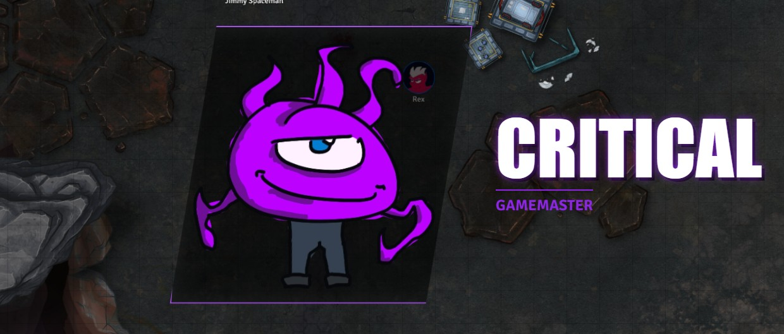
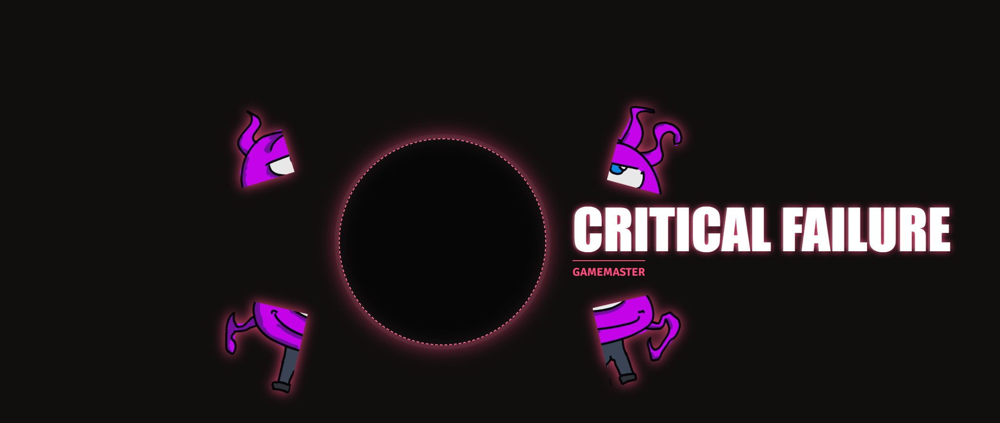

# HoloSuite Critical Cut-In

HoloSuite Critical Cut-In adds critical hit animations to your Foundry VTT game. When a player rolls a qualifying natural result on the selected die (d20 by default), a full-screen cut-in flashes across every connected screen with the character's portrait, a custom sound effect, and an overlay label. It turns a lucky roll into a memorable cinematic moment.

## What Does It Do?

- Watches the selected die and triggers a visual cut-in animation when a natural result meets the configured success or failure threshold. Choose whether high or low rolls are positive.
- Each player character can have their own custom cut-in setup: unique image, sound effect, animation style, overlay text, and accent color.
- The GM can set a global threshold (for example, natural 20 only, or natural 19 and above) and also override the threshold per character.
- A GM cut-in configuration covers rolls that do not belong to a specific player character.
- The cut-in duration is adjustable so you can control how long the animation stays on screen.

## Tutorial: Using Critical Cut-In as a DM

### Initial Setup

1. Enable **HoloSuite Critical Cut-In** & **Holosuite-core** in your Foundry world.
2. Open **Configure Settings**, then go to **Module Settings** and find **HoloSuite Critical Cut-In**.
3. Click **Configure Player Cut-Ins** to open the configuration panel. Choose the **Check die** dropdown and whether **High rolls are positive** or **Low rolls are positive**. Die options include Foundry's standard d4, d6, d8, d10, d12, d20, and d100, additional registered numbered dice, and any previously saved custom die. Non-numeric dice such as Fate dice are not supported by these numeric checks.
4. Changing the die or positive roll direction asks for confirmation before resetting the global thresholds and both Success and Failure tabs for every listed player/GM entry. For d100/high, success resets to 100 and failure to 1; for d100/low, success resets to 1 and failure to 100. Cancel keeps the previous die, direction, and thresholds. Confirm stages the changes; click **Save** to persist them.

### Configuring Player Cut-Ins

1. Each player-owned actor in the world gets a row in the configuration panel.
2. For each actor, you can set:
   - **Enable/Disable**: Turn the cut-in on or off for that character.
   - **Success / Failure Threshold**: Set a custom threshold for this character. Leave it blank to use the global default. The ≥ or ≤ label follows the selected roll direction.
   - **Animation Style**: Choose how the cut-in animates onto the screen.
   - **Image**: Pick a custom image for the cut-in. If you leave this blank, the actor's portrait is used automatically.
   - **Audio**: Select a sound effect that plays during the cut-in.
   - **Overlay Label**: Set the text that flashes on screen (like "CRITICAL HIT" or a character catchphrase).
   - **Accent Color**: Choose a color that tints the cut-in border and effects.
3. The **GM Cut-In** row at the top covers any rolls the GM makes that do not match a configured player actor.
4. Adjust the **global duration** field to control how many milliseconds the animation stays visible.

The confirmed reset changes only roll thresholds. Images, sounds, animations, labels, colors, and enabled states stay unchanged. You can customize individual thresholds again before saving. Global thresholds of 0 and blank actor thresholds remain available for automatic/inherited values. Only natural results on the selected die are checked; modifiers, discarded/rerolled dice, and identified damage rolls do not trigger cut-ins. Dice pools are checked per active die, not by their sum. A percentile roll must be represented as a d100 term to match a d100 selection.

### Using It in Play

Once configured, the module runs automatically. Qualifying rolls trigger the cut-in with no extra input needed. You can also trigger a cut-in manually for testing or dramatic effect by running a macro.

## Tutorial: Using Critical Cut-In as a Player

### What You See

1. Roll the die selected by the GM as part of normal gameplay (attacks, skill checks, saves, etc.).
2. If your natural roll meets the success or failure threshold in the configured direction, a cut-in animation fires across the screen.
3. Your character's portrait (or custom image), sound effect, and overlay text flash on screen for a moment before fading away.
4. That is it. There is nothing you need to do. The module handles everything automatically based on your rolls.

### Things to Know

- The GM controls the trigger threshold and all visual settings. If you want a custom image or catchphrase for your character's cut-in, talk to your GM about setting it up.
- The cut-in is purely visual and does not affect game mechanics. It is a celebration of a great roll, nothing more.
- If your GM has not configured a cut-in for your character, the module will use your actor portrait as a fallback image.
