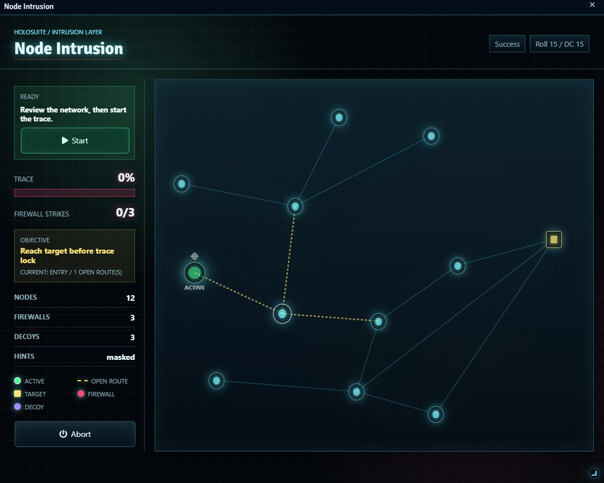
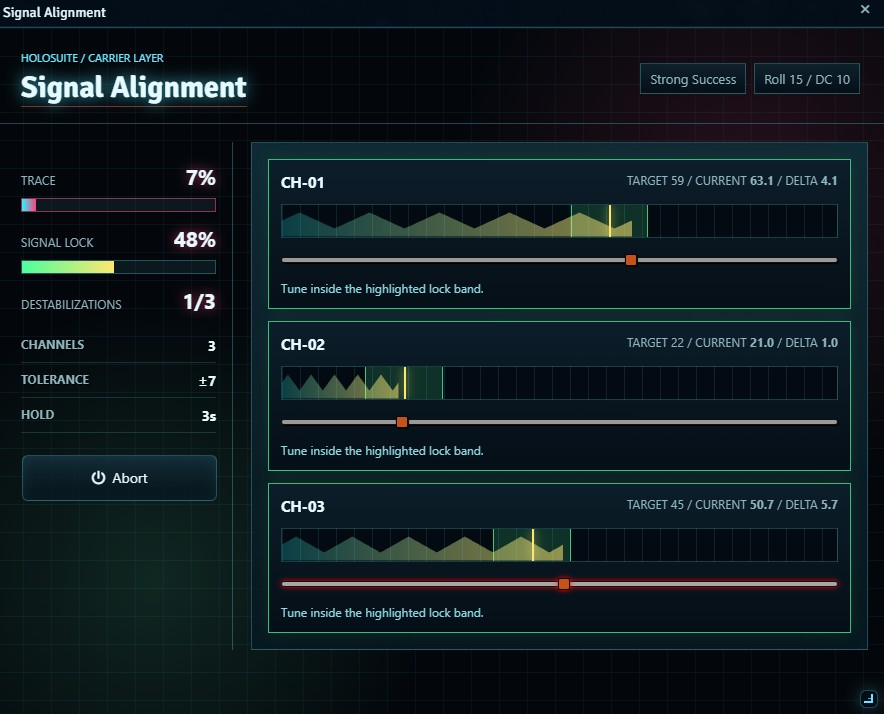

# HoloSuite Hacking

HoloSuite Hacking brings interactive hacking minigames to your Foundry VTT sessions. Instead of resolving a hack with a single dice roll, this module puts the player in a timed puzzle where their roll determines the difficulty. It currently includes two minigames, with more planned.

## What Does It Do?

- Adds playable hacking minigames that the GM can launch for any player during a session.
- **Node Intrusion**: The player navigates through a randomized network of nodes, reading local radar warnings, managing firewall and decoy risks, and trying to reach the target before a trace timer runs out.
- **Signal Alignment**: The player hunts for unstable signal targets, tunes channels into their target range, and holds them steady until a transmission decrypts.
- Difficulty scales with the player's skill check. A good roll gives more time and clearer assists; a bad roll makes routes riskier or Signal Alignment targets harder to find and hold.
- The GM picks the minigame, selects a player and their character's hacking skill, sets a DC, and sends the challenge. The player's client rolls the skill check and launches the minigame based on the result.

## How Difficulty Works

When the GM sends a hacking challenge, the player's skill check is compared to the DC. The margin of success or failure determines one of five difficulty profiles. A natural 20 always uses the critical success profile, and a natural 1 always uses the critical failure profile.

- **Critical Success** (natural 20 or beat the DC by 10 or more): Long trace timer, stronger assists, Node Intrusion target marker visible, and fewer hazards.
- **Strong Success** (beat the DC by 5 or more): Comfortable difficulty with radar enabled and a reasonable margin for error.
- **Success** (met or beat the DC): Standard difficulty. The puzzle is fair but requires focus, and the target is not revealed up front.
- **Failure** (missed the DC): Less time, fewer assists, more hazards, and fewer protected route options. Still playable, but tense.
- **Critical Failure** (natural 1 or missed the DC by 10 or more): Maximum difficulty. Very little time, no radar by default, dense hazards, slower node takeovers, and harsher trace penalties.

## Tutorial: Using HoloSuite Hacking as a DM

### Launching a Hack

1. Enable **HoloSuite Hacking** & **Holosuite-core** in your Foundry world.
2. Open the hacking launcher from the HoloSuite launcher.
3. In the launcher, choose:
   - The **minigame** (Node Intrusion or Signal Alignment).
   - The **actor** who is doing the hacking.
   - The **player** who owns that actor.
   - The **skill** to roll (this comes from the actor's sheet).
   - The **DC** for the check.
4. Click **Send Challenge**. The selected player receives a prompt asking them to accept.
5. When the player accepts, their client rolls the skill check and the minigame opens at the appropriate difficulty.

### Watching the Result

- The minigame runs on the player's screen. You can watch over their shoulder or wait for the result.
- When the player succeeds or fails, the result is reported so you can narrate the outcome.

### Adjusting Settings

- **Default Hacking DC**: Sets the default DC in the launcher so you do not have to type it every time.
- **Default Trace Duration Multiplier**: Scales all trace timers up or down. Increase this to give players more breathing room, or decrease it for a faster pace.
- **Node Takeover Duration Override**: Optionally forces one global node takeover time for Node Intrusion. Set it to 0 to use each difficulty profile's own timing.
- **Difficulty Profiles**: Opens a profile editor for Node Intrusion and Signal Alignment tuning. Each profile can adjust per-minigame trace time, node count, safe routes, hazards, radar, takeover timing, signal channels, tolerance, drift, target reveal radius, hold time, and trace spike penalties.
- **Visual Glitch Intensity**: A client-side setting (low, medium, or high) that controls how much visual noise the minigame displays. Players can set this to their own preference.

The difficulty profile editor applies logical limits while you edit. Decoys are capped by node count, firewalls are capped by available non-protected nodes unless protected-route firewalls are enabled, and route counts are capped by what the generated map can support. Each profile also has its own reset button to return only that profile to the module default.

## Tutorial: Using HoloSuite Hacking as a Player

### Accepting a Challenge

1. When the GM sends you a hacking challenge, a prompt appears on your screen asking you to accept.
2. Click **Accept**. Your client rolls the selected skill against the DC.
3. The minigame opens, and the difficulty depends on how well you rolled.

### Playing Node Intrusion

1. You see a randomized network of connected nodes. Your goal is to reach the target before the trace timer fills up.
2. Click on adjacent nodes to claim them. Claiming a node takes a short amount of time, so rushing across the map is risky.
3. Radar, when enabled, shows adjacent danger on current, visited, and reachable nodes. It warns that nearby choices may contain firewalls or decoys, but it does not reveal the exact hazard unless hints are enabled.
4. Firewalls add trace pressure. By default they burn the route they are on; if the GM enables passable protected-route firewalls, they take longer to claim but can be crossed.
5. Decoys add trace pressure and burn that route.
6. Reach the target node before the trace catches you to succeed. If the trace completes first, the hack fails.

### Playing Signal Alignment

1. You see one or more signal channels with fluctuating values.
2. Use the controls to hunt for each channel's target range. Harder profiles only reveal the target when you are close.
3. Hold all channels within their targets at the same time until the transmission decrypts.
4. If the signal destabilizes after lock, the trace jumps forward.

### Things to Know

- A better skill check gives you an easier puzzle. A worse check makes it harder, but you still get to play.
- Critical successes reveal the Node Intrusion target marker by default. Signal Alignment targets reveal based on proximity, controlled by each profile's reveal radius.
- Even on a critical failure, you can attempt the puzzle. It will be very difficult, but the generator keeps at least one protected route unless the GM deliberately enables harsher protected-route firewall behavior.
- The trace timer is always running. Work quickly but carefully.
- You can adjust the **Visual Glitch Intensity** in module settings if the visual effects are too distracting or not intense enough for your taste.
