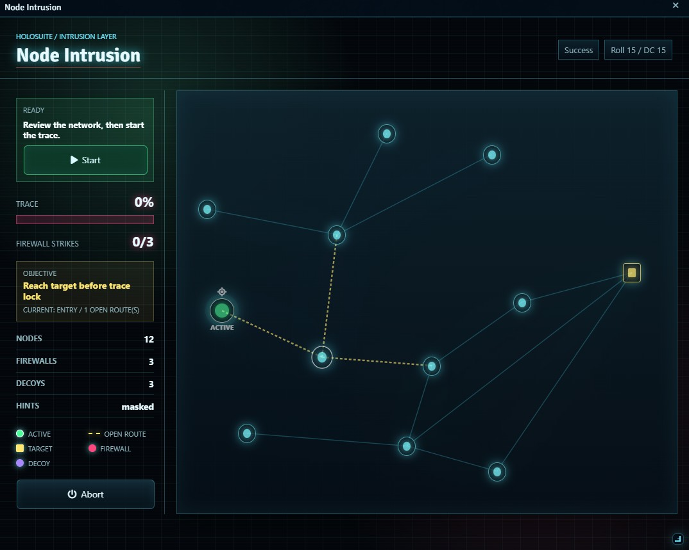
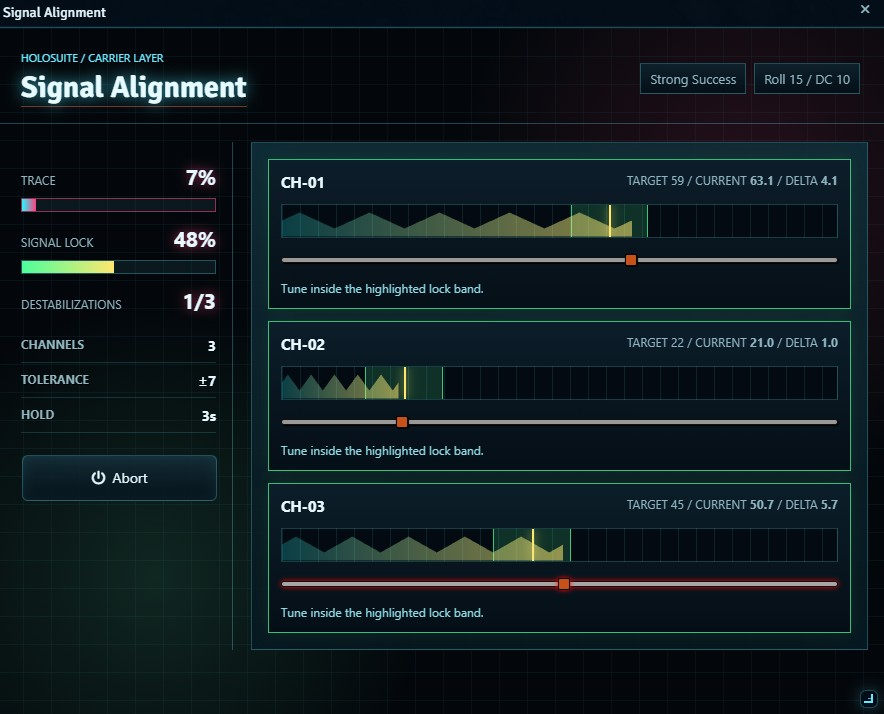

# HoloSuite Hacking

HoloSuite Hacking brings interactive hacking minigames to your Foundry VTT sessions. Instead of resolving a hack with a single dice roll, this module puts the player in a timed puzzle where their roll determines the difficulty. It currently includes four minigames, with more planned.





## What Does It Do?

- Adds playable hacking minigames that the GM can launch for any player during a session.
- **Node Intrusion**: The player navigates through a randomized network of nodes, reading local radar warnings, managing firewall and decoy risks, and trying to reach the target before a trace timer runs out.
- **Signal Alignment**: The player hunts for unstable signal targets, tunes channels into their target range, and holds them steady until a transmission decrypts.
- **Packet Switchboard**: The player directly sets routing junctions while colored packets cross the board, guiding each packet into its matching output before the trace completes.
- **Prism Lock**: The player rotates concentric optical rings to illuminate authorization receptors while avoiding blockers, dangerous ICE receptors, and decoy rings.
- Difficulty scales with the player's skill check. A good roll gives more time and clearer assists; a bad roll makes routes riskier or Signal Alignment targets harder to find and hold.
- The GM picks the minigame, selects a player and their character's hacking skill, sets a DC, and sends the challenge. The player's client rolls the skill check and launches the minigame based on the result.

## How Difficulty Works

When the GM sends a hacking challenge, the player's skill check determines the minigame difficulty. The launcher offers three **Roll source** modes, and remembers the last selection for subsequent launches and as the initial choice for new attached hacks:

- **System skill roll**: Available for D&D 5e, PF2e, Starfinder 2e (`sf2e`), CoC7, and Cyberpunk RED. Opens the system's own skill-check dialog, including its modifiers and dice rules, then starts the minigame automatically. Nothing is added a second time. Cancelling the dialog cancels the hack without rolling a fallback. D&D 5e, PF2e, and SF2e use the returned total and kept natural die against the hacking DC. CoC7 uses its native degrees of success. RED uses the final adjusted total, including its critical die and Luck, and must beat the DC (its DV); natural 1/10 does not automatically decide success. Custom dice settings do not apply.
- **Custom dice roll**: Available for any system. Choose the **Check die**, **Dice count** (1–10), **Result to keep** (best or worst), and **Static modifier** (default 0). The check adds the character's current skill modifier, preferring the system's computed total over its base modifier, then adds the GM's static modifier. A negative static modifier subtracts; for example, a kept die of 12, skill modifier +4, and static modifier -2 gives 14. The static modifier is remembered and ignored by System skill roll. Conditional bonuses and bonus dice require a supported system roll. The die dropdown includes d4, d6, d8, d10, d12, d20, d100, additional registered numbered dice, and any previously saved custom die.

- **Roll from character sheet**: The general fallback, available even when skills cannot be detected. Accepting a challenge opens the sheet automatically and shows a small waiting notice. Roll normally, then click **Use for hacking** directly on the new chat result. There is no confirmation dialog or outcome dropdown. Cards containing multiple readable rolls get a button for each total. Hacking compares the selected total to the GM's DC and positive-roll direction; it never adds modifiers again or infers natural criticals. Buttons appear only on the current user's new, visible rolls, excluding rolls attributed to another character. Selection or **Cancel hack** removes all buttons and listeners. For unusual chat cards without readable totals, manual entry is tucked under **Can't use your chat roll?** in the waiting notice. Closing the sheet alone does not cancel the pending check.

**System skill roll is the default where supported; other systems default to Roll from character sheet.** An explicitly saved roll-source choice is preserved, including Custom dice roll. To use newly added native support, select System skill roll once. Terminal attachments save their own choice and use the same roll flow. PF2e and SF2e share a statistic-roll adapter; systems without a known native interface use the chat-button fallback.

Cyberpunk RED skill choices resolve to the character's owned skill Items, including older selections saved from skill summaries. Sheet-roll capture also reads RED's HTML-only d10 result cards, using the displayed final total. Standard Foundry rolls take priority; unknown card formats still use the manual-total fallback.

Skill dropdowns show names only by default. Enable **Configure Settings → HoloSuite Hacking → Show Skill Modifiers** to also display modifiers or skill percentages in the launcher. The attached-hack editor shows names only because it has no selected character. This changes only the display; rolls still use the same values. Hover or focus any launcher label for a short explanation. Roll source help describes the selected mode without system-specific instructions.

**CoC7:** Skills are read from the selected character's owned skill Items; with **Show Skill Modifiers** enabled, they display the system's computed percentage (for example, Computer Use (65%)). Native checks call CoC7's `actor.runRoll` API, verified against the 7.22 and 8.15 source contracts, so skill effects and bonus/penalty dice stay under system control. Choose Regular, Hard, or Extreme difficulty in CoC7's dialog. Native checks always use low-positive percentile results; the hacking DC and Positive rolls setting apply to Custom rolls, chat-selected totals, and the fake Test Yourself preview. Critical or extreme success selects Critical Success, hard success selects Strong Success, regular success selects Success, a failed required check selects Failure, and a fumble selects Critical Failure. Terminal, mail, and file locks use the same outcomes. Skill choices use CoCIDs where available, otherwise unique names, so each player's own copy can be resolved even when Item IDs differ.

Skill discovery also recognizes explicit `type: "skill"` Items in other systems when the standard actor skill list is empty. This improves discovery, but does not assume that an Item's numeric value is an additive modifier or that the system shares CoC7's roll API. Custom rolls for Item-based skills use only the GM's Static modifier; a CoC7 percentage is never added to the die. Unknown roll APIs still require a system adapter for native checks.

If the module cannot find skills for the selected character, the skill selector shows **No skills detected** with a warning icon instead of generic skills. Hover the icon for instructions: use **Roll from character sheet**, or **Custom dice roll** with adjustments in **Static modifier**. The same warning appears in Terminal configuration, including mail and file locks. The popup stays open after the pointer leaves, allows text selection to copy **magetowerfoundry@gmail.com**, and closes when clicking elsewhere (or pressing Escape). Reports should include the system name/version and Foundry and HoloSuite module versions. Existing Terminal skill settings are preserved when skills cannot be detected.

Custom rolls, chat-selected totals, and native D&D 5e/PF2e/SF2e checks offer **High rolls are positive** or **Low rolls are positive**. With high positive, keeping the best means highest and worst means lowest; low positive reverses these. For example, 2d20/keep best/high is advantage-style rolling, while 2d100/keep best/low keeps the lower die. Only one die is kept, and discarded or rerolled dice never trigger natural criticals. All choices are saved; switching modes preserves the custom dice preferences. CoC7 native checks use their own percentile outcomes instead of these comparisons.

Choosing low rolls changes the comparisons, not the modifier's sign or the system's skill calculation. Set the DC to the desired target number. For Custom and native D&D 5e/PF2e/SF2e checks, the best natural face gives critical success and the worst gives critical failure: d100/low uses 1 for success and 100 for failure. Other dice in a roll are not used for natural criticals.

The five profiles below describe the default d20/high configuration. For low rolls, meeting or rolling under the DC succeeds; rolling 5 or 10 below it gives strong or critical success, and rolling 10 above it gives critical failure. The margin bands remain 5 and 10 regardless of die size.

- **Critical Success** (natural 20 or beat the DC by 10 or more): Long trace timer, stronger assists, Node Intrusion target marker visible, and fewer hazards.
- **Strong Success** (beat the DC by 5 or more): Comfortable difficulty with radar enabled and a reasonable margin for error.
- **Success** (met or beat the DC): Standard difficulty. The puzzle is fair but requires focus, and the target is not revealed up front.
- **Failure** (missed the DC): Less time, fewer assists, more hazards, and fewer protected route options. Still playable, but tense.
- **Critical Failure** (natural 1 or missed the DC by 10 or more): Maximum difficulty. Very little time, no radar by default, dense hazards, slower node takeovers, and harsher trace penalties.

## Tutorial: Using HoloSuite Hacking as a DM

### Launching a Hack

For the fastest setup, click **Quick Hack** at the top of the launcher. Only **Minigame**, **Player**, and **Hacker character** remain. Resolve the check outside the module however your table prefers, then click **Critical Success**, **Strong Success**, **Success**, **Failure**, or **Critical Failure** to send the minigame at that difficulty. The incoming prompt shows the chosen result and a **HACK** button; no skill detection, dice roll, chat-roll selection, or DC setup is required.

The outcome determines puzzle difficulty, not whether the puzzle is automatically completed. Players still play the minigame, and the final success/failure comes from their play. Quick Hack uses the configured live audience and difficulty tuning. Its game headers, spectator views, and result cards show a GM-selected difficulty without a fabricated roll total. **Full setup** restores the normal controls without changing their values. The launcher remembers its mode on the GM's client; normal roll preferences, including Terminal checks, stay unchanged.

1. Enable **HoloSuite Hacking** & **Holosuite-core** in your Foundry world.
2. Open the hacking launcher from the HoloSuite launcher.
3. In the launcher, choose:
   - The **minigame** (Node Intrusion, Signal Alignment, Packet Switchboard, or Prism Lock).
   - The **actor** who is doing the hacking.
   - The **player** who owns that actor.
   - The **skill** to roll (this comes from the actor's sheet).
   - The **roll source** and whether **high or low rolls are positive**. For Custom dice roll, also choose the die, dice count, result to keep, and static modifier. These choices are remembered, including when testing yourself (Test Yourself still uses the entered final fake total, without adding modifiers again).
   - The **DC** for the check.
   - The **live audience**: GM and players, GM only, or nobody.
4. Click **Send Challenge**. The selected player receives a prompt asking them to accept.
5. When the player accepts, native rolls open the system's dialog and then launch the minigame. With Roll from character sheet, the sheet opens and the player clicks **Use for hacking** on their new chat roll.

### Watching Live

- When the player accepts, the selected audience automatically receives the same minigame in a read-only window.
- The hacking player's browser remains authoritative. Spectators see board changes, movement, timers, penalties, and the final outcome in real time, but cannot interact with the puzzle.
- A client that connects or refreshes during an active hack requests the latest state and rejoins the live view automatically.
- When the player succeeds or fails, the result is reported so you can narrate the outcome.

### Adjusting Settings

- **Default Hacking DC**: Sets the default DC in the launcher so you do not have to type it every time.
- **Hacking Roll Source**, **Hacking Check Die**, **Hacking Custom Dice Count**, **Hacking Custom Result**, **Hacking Custom Static Modifier**, and **Hacking Positive Rolls**: The saved launcher preferences, also used initially for new attached hacks. Existing attachments keep their saved roll settings.
- **Default Trace Duration Multiplier**: Scales all trace timers up or down. Increase this to give players more breathing room, or decrease it for a faster pace.
- **Node Takeover Duration Override**: Optionally forces one global node takeover time for Node Intrusion. Set it to 0 to use each difficulty profile's own timing.
- **Difficulty Profiles**: Opens a profile editor for all four minigames. Prism Lock profiles control ring and receptor counts, angular positions, blockers, ICE hazards, switchable rings, scrambling, and trace penalties.
- **Default Live Hacking Audience**: Sets the initial live-audience choice in the launcher. The GM can override it for each challenge.
- **Watch Other Players' Hacks**: A per-client setting available to GMs and players. Disable it to suppress all spectator windows on your own screen without changing what anyone else sees.
- **Visual Glitch Intensity**: A client-side setting (low, medium, or high) that controls how much visual noise the minigame displays. Players can set this to their own preference.

The difficulty profile editor applies logical limits while you edit. Decoys are capped by node count, firewalls are capped by available non-protected nodes unless protected-route firewalls are enabled, and route counts are capped by what the generated map can support. Each profile also has its own reset button to return only that profile to the module default.

API callers may pass `rollSource: "system" | "custom"`, `dieSides`, `diceCount`, `keepResult: "best" | "worst"`, `staticModifier` (a finite number), and `rollDirection: "high" | "low"` to `sendHackToPlayer` or `rollSkillCheck`. Omitted values use saved preferences. Call `rollSkillCheck({ actor, skillId, dc, flavor, ...rules })` to perform a check; it returns `total`, `naturalRoll`, `roll`, and the rules used, or `null` on cancellation/failure. Native adapters use the system's d20 regardless of the stored custom die and ignore the custom static modifier. In custom mode, `skillModifier` is used only when the actor's skill data is unavailable; `staticModifier` is always an additional adjustment. `flavor` is chat HTML and should be escaped by the caller. `supportsSystemSkillRoll()` reports native support; `getActorSkillOptions(actor)`, `resolveSkillId(actor, idOrName)`, and `getSkillData(actor, skillId)` help integrations resolve skills consistently.

Pass the returned total, natural result, and rules to `startHack` or a dedicated minigame starter to launch the puzzle without rolling again. These starters accept an existing `rollTotal`; they do not open a system roll dialog themselves. `getDifficultyProfile(total, dc, naturalRoll, options)` accepts `dieSides` and `rollDirection` as its fourth argument.

## Shared Hack Configuration

Terminal login, files, mail messages, and cameras can open the shared editor with **Add Hack**. It uses the launcher controls without Player, Hacker character, Test Yourself, or sending controls. Choose a skill from detected world actors; the editor stores its portable identifier and never a character's modifier. Custom checks can select **No skill modifier**. Quick Hack selects a fixed outcome, followed by **Add** or **Save**, without sending a request during configuration.

In attached Quick Hack setup, **Add** (or **Save** when editing) appears directly below the outcome buttons. Selecting an outcome alone does not attach the hack; click the action to return it to the parent module's form.

Each returned configuration stores its own roll rules. The editor never changes launcher preferences. **Cancel** or closing returns `null`; the integrating module commits the returned configuration when its parent form is saved.

Other modules can use the same API:

```js
const hacking = game.modules.get("holosuite-hacking").api;
// GM configuration: store the returned plain object on your file, lock, etc.
const configuration = await hacking.configureHack(existingConfiguration ?? null, { title: "Encrypted file" });
if (configuration) { /* Save configuration with your target. */ }

// Player attempt: unlock only after actual puzzle success.
const success = await hacking.runConfiguredHack(savedConfiguration, {
  actor: game.user.character,
  label: "Encrypted file"
});
if (success) { /* Unlock your target. */ }
```

`createHackConfiguration(options)` captures defaults into a versioned serializable object for migrations or programmatic setup. `getConfigurationSkills()` supplies portable choices without numeric modifiers. `runConfiguredHack` resolves the current character's skill, applies the saved check rules or Quick Hack outcome, and starts the puzzle with the saved live audience. It returns `false` for cancellation, closing, failure, missing required skills, unsupported configuration versions, or unavailable minigames. Integrations remain responsible for authorization and persisting unlocks. Global difficulty-profile tuning and client visual preferences still apply.

## Tutorial: Using HoloSuite Hacking as a Player

### Accepting a Challenge

1. When the GM sends you a hacking challenge, a prompt appears on your screen asking you to accept.
2. Click **Accept**. Your client rolls the selected skill against the DC.
3. The minigame opens, and the difficulty depends on how well you rolled.

### Playing Node Intrusion

1. You see a randomized network of connected nodes. Your goal is to reach the target before the trace timer fills up.
2. Click on adjacent nodes to claim them. Claiming a node takes a short amount of time, so rushing across the map is risky.
3. Radar, when enabled, shows adjacent danger on current, visited, and reachable nodes. It warns that nearby choices may contain firewalls or decoys, but it does not reveal the exact hazard unless hints are enabled.
4. Firewalls add trace pressure. By default they burn the route they are on; if the GM enables passable protected-route firewalls, they take longer to claim but can be crossed.
5. Decoys add trace pressure and burn that route.
6. Reach the target node before the trace catches you to succeed. If the trace completes first, the hack fails.

### Playing Signal Alignment

1. You see one or more signal channels with fluctuating values.
2. Use the controls to hunt for each channel's target range. Harder profiles only reveal the target when you are close.
3. Hold all channels within their targets at the same time until the transmission decrypts.
4. If the signal destabilizes after lock, the trace jumps forward.

### Playing Packet Switchboard

1. Each colored packet must travel from its listed input to the matching output port.
2. Click anywhere on a junction cell to cycle its arrow direction. Alternatively, hover a junction and press Up, Right, or Down to directly select that direction without clicking it first.
3. Every junction draws a connection line toward the node or output it currently targets. The highlighted line previews the oldest active packet's complete route: green reaches the correct output, while red currently ends at the wrong output.
4. Watch the full `IN → OUT` queue and prepare routes during the packet's staging pause. Difficulty profiles cap how many packets can be active simultaneously.
5. Correct deliveries fill the payload meter. A packet sent to the wrong output is corrupted and adds trace pressure.

### Playing Prism Lock

1. Rotate each optical ring one position at a time and watch how its emitters and blockers redirect the laser lattice.
2. Illuminate every white authorization receptor around the outside of the lock at the same time.
3. Avoid illuminating red ICE receptors. Newly energized ICE adds trace pressure.
4. Harder locks include switchable decoy rings. Phase those rings out when their emitters interfere with a valid solution.

### Things to Know

- A better skill check gives you an easier puzzle. A worse check makes it harder, but you still get to play.
- Critical successes reveal the Node Intrusion target marker by default. Signal Alignment targets reveal based on proximity, controlled by each profile's reveal radius.
- Even on a critical failure, you can attempt the puzzle. It will be very difficult, but the generator keeps at least one protected route unless the GM deliberately enables harsher protected-route firewall behavior.
- The trace timer is always running. Work quickly but carefully.
- You can adjust the **Visual Glitch Intensity** in module settings if the visual effects are too distracting or not intense enough for your taste.
